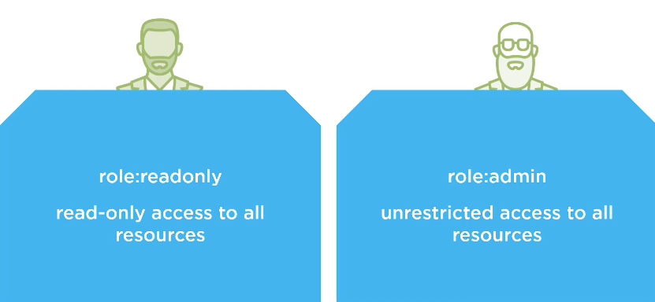
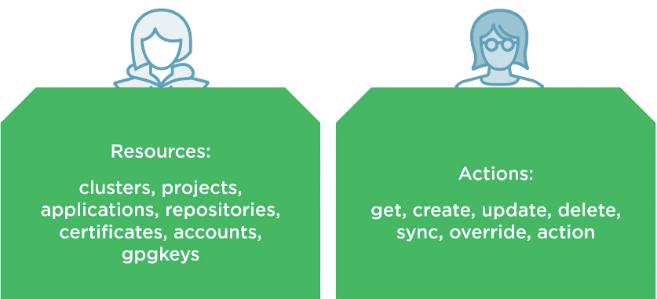
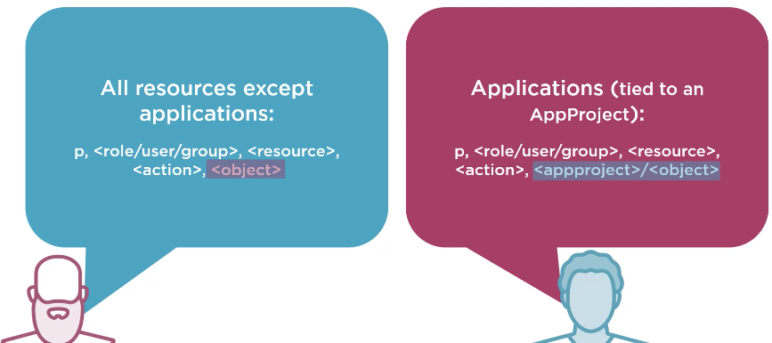

# argocd
Repository containing hypotetical bootstrap of ArgoCD

<a href="https://argo-cd.readthedocs.io/en/stable/"></a>

---

# Requirements:
- `kubectl` command line tool installed.
- k8s cluster
- Cluster Admin Level Access
- kubeconfig configured to connect to your cluster
- Access to GitHub

**NB** I am using Docker K8s Cluster for localtesting of the lab.

---


# Deploying Argo CD:

## Types of installs:

### Non High Availability


- Manifest = install.yaml
- Recommended for dev
- Single pods and replicas for Argo CD components

### High Availability


- Manifest = namespace-install.yaml
- Recommended for prod
- Turned for high availabiltiy and resiliency
- Multiple replicas for supported components

### Core Install
- Manifest = core-install.yaml
- Use when multi-tenancy features (web ui, API server, etc...) are not needed
- Installs the lightweight (non-HA) Version of each component

### Cluster Level Installation


- Use when you have cluster level access nad will deploy apps in the same cluster Argo CD runs on.

### Namespace Level Installation


- Use when you have namespace level access and will deploy apps to **external** K8s Clusters from where Argo CD is running.
- You need to authenticate the external clusters with Argo CD.

## Install Argo CD:

1. Create a namespace for Argo CD to deploy all of its components in:

```bash
kubectl get namespace argocd
``` 
Or you could adjust the ```provider.tf``` file to work with your cluster or set it up with a remote ```backend.tf``` 

2. Install Argo CD into the new namespace you created. Reference Argo CD's GitHub repository for the latest Argo CD operator.


*Hint* this is from the stable release branch!
```bash
kubectl apply -n argocd -f https://raw.githubusercontent.com/argoproj/argo-cd/stable/manifests/install.yaml
```
## URL Logic:

Non HA (High Availabiltiy)
```bash
VERSION=v2.13.1
https://raw.githubusercontent.com/argoproj/argo-cd/$VERSION/manifests/install.yaml
```

HA
```bash
VERSION=v2.13.1
https://raw.githubusercontent.com/argoproj/argo-cd/$VERSION/manifests/ha/install.yaml
```


# Accesss Argo CD API Server

There only two ways:

1. Web UI
2. Argo CD CLI


MacOS/Linux
```bash
brew install argocd
```

Windows
```pwsh
Chocolatey install argocd-cli
```


## Argo CD CLI

- Argo CD has a Command Line Interface to Access the API Server
- Some Activities can only be performed via the Argo CD CLI such as **adding new cluster** and managing user accounts
- Script/Automate Using Argo CD CLI

### Common commands:

[Check Here](commands.md)

## Argo CD Web UI

### Use Service Type Load Balancer

```bash
kubectl patch svc argocd-server -n argocd -p '{"spec": {"type": "LoadBalancer"}}'
```

If you are using a local k8s emulator: https://localhost

### Port Forwarding

```bash
kubectl port-forward svc/argocd-server -n argocd 8080:443
```

### Password First Time 

- Get inital password
```bash
argocd admin initial-password -n argocd
```
- Change password

```bash
argocd account update-password
```

## Upgrading Argo CD

- Follows Sematic Versioning

| Major       | Minor       | Patch      |
| -------------------------------------------------- | ----------- | -----------|
| Major versions makes **incompatible** API Changes      | Minor version adds **functionality** in a compatible manner | Patch Makes **backward compatible** bug fixes|
| Major Introduces backward incompatible behaviour changes with previous Argo CD versions| Minor might introduce changes to Argo CD with a workaround | Patch such as Argo CD v1.6.1 to 1.6.3 does not introduce any breaking changes|


### Quick scripts for upgrade:

> You just need to increment the numbers 🧐

Non HA (High Availabiltiy)

```bash
#!/bin/bash

VERSION=v2.13.1
kubectl apply -n argocd -f https://raw.githubusercontent.com/argoproj/argo-cd/${VERSION}/manifests/install.yaml
```

HA
```bash
#!/bin/bash

VERSION=v2.13.1
kubectl apply -n argocd -f https://raw.githubusercontent.com/argoproj/argo-cd/${VERSION}/manifests/ha/install.yaml
```

## RBAC (Role Based Access Control)

- Argo CD's RBAC feature enables restriction of access to Argo CD resources.

- Since Argo CD does not have its own user management system it requires SSO configuration or local users set up.

> Recommended path is SSO (Okta, Entra ID, etc) **if** teams are > 5 <br>
> Recommended path is just users **if** users are < 5

- After either SS or local users is setup in Argo CD more RBAC roles can be defined, and local users or SSO users/groups can be mapped to these roles.

#### There are two Built-in Roles:

| role:readonly | role:admin |
| -------------| ---------- | 
| read-only access <br> to all resources | unrestricted access <br> to all resources |



### Resources and actions:

| Resources | Actions |
| -------------| ---------- | 
| clusters, projects, <br> applications, repositories, <br> certificates, accounts, <br> gpgkeys | get, create, update delete, <br> sync, override, action |



### Permissions:


| All resources except <br> applications | Applications (tied to an AppProject) |
| -------------| ---------- | 
| p, <role/user/group>, <br> 'action', `object`| p, <role/user/group>, <resource>, <br> 'action', `<appproject>/<object>` |




### Example ConfigMap argocd-rbac-cm:

```yaml
apiVersion: v1
kind: ConfigMap
metadata: 
  name: argocd-rbac-cm
  namespace: argocd
data:
  policy.default: role:readonly ➡️
  policy.csv: | ➡️
   p, role:org-admin, applications, *, */*, allow
   p, role:org-admin, clusters, get, *, allow
   p, role:org-admin, repositories, get, *, allow
   p, role:org-admin, repositories, create, *, allow
   p, role:org-admin, repositories, update, *, allow
   p, role:org-admin, repositories, delete, *, allow
   g, my-github:teama, role:org-admin, *, */*, allow  ➡️
```

> Configures a custom role ⬅️ 1 <br>
The role is assigned to users that belong to a my-github:teama group in GitHub ⬅️ <br> 
Other users will get the default policy of role:readonly ⬅️
